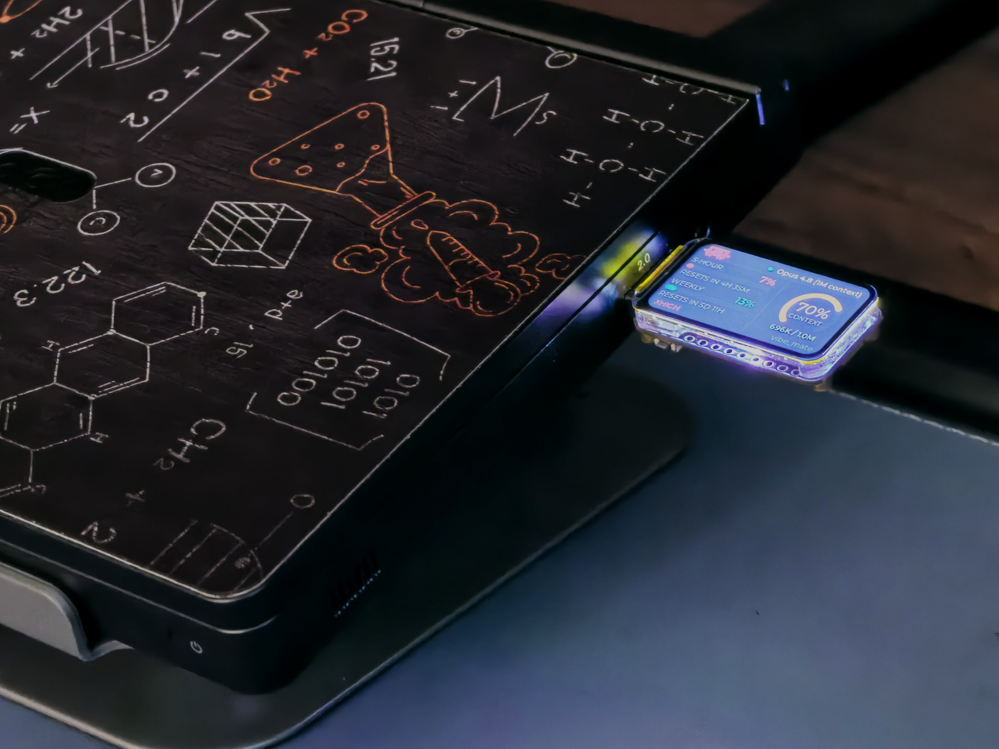

# CodeMate

[English](README.md) | **简体中文**


**Claude Code**(以及 **Codex CLI**)的 USB 桌面小屏:一块自带 1.47 寸屏的 ESP32-S3
开发板,实时显示你的用量、上下文窗口与工作状态;数据由一个常驻任务栏的轻量 Windows
程序经 USB 串口下发。




## 特性

- **官方用量百分比** —— 5 小时 / 每周限额窗口和上下文占用直接取自 Claude Code 的
  statusline 数据,与 `/usage` 完全一致;全程本地读取,不额外联网。
- **工作状态 LED** —— 生成中板载 RGB 灯随机色呼吸,空闲时蓝色常亮。
- **多会话** —— 每个打开的 Claude Code / Codex 终端都被跟踪;短按设备 BOOT 键
  (或用自动跟随模式)在会话间切换。
- **Codex CLI 支持** —— Codex 会话进同一个切换循环,带自己的主题色和限额窗口。
- **文本滚动屏** —— 合上笔记本盖子,设备切换为滚动显示助手最新回复(全中文字体)。
- **系统监控屏** —— CPU / 内存 / 显存 / 磁盘活动 / 公网 IP;没有任何编码会话时
  自动显示,也可用 BOOT 键随时切到。
- **单个 ~1 MB exe** —— 主机端是一个 Rust 单文件:托盘、配置窗、钩子、串口 host
  全在里面,除 WebView2 外无运行时依赖。
- **U 盘自安装** —— 设备可变身只读 U 盘,盘里自带 `CodeMate.exe`,插上即装。

## 硬件

一块板子,免焊接:**微雪 Waveshare ESP32-S3-LCD-1.47**
(ESP32-S3R8,16MB Flash / 8MB PSRAM,ST7789 172×320 IPS,原生 USB CDC)。
[官方 wiki](https://www.waveshare.net/wiki/ESP32-S3-LCD-1.47) ·
[引脚与固件细节](firmware/README.md)

按「插在电脑右侧 USB-A 口」设计:接头在左、横屏朝向使用者。

## 工作原理

```
┌─ 电脑 —— 常驻托盘的主机端(CodeMate.exe)────────────────────────────┐
│                                                                     │
│  Claude Code ── statusline + 活动钩子 ──►  按会话落盘的快照           │
│  Codex CLI  ─── 会话钩子 ──────────────►  (~/.claude/code_mate/)    │
│                                                  │                  │
│  系统指标(CPU/内存/显存/磁盘/公网 IP)────────────┤                  │
│                                                  ▼                  │
│                    USB CDC 串口,按行分隔的 JSON 帧                   │
└──────────────────────────────┬──────────────────────────────────────┘
                               ▼
                  ESP32-S3 1.47 寸屏 + RGB LED
                仪表盘 / 文本 / 系统监控 三块屏
```

钩子就是同一个 exe 的子命令(`--statusline`、`--activity`、`--codex-activity`):
Claude Code 每次回复后调用它们,原子写入按会话的快照文件;host 汇总、选择并把数据帧
流式发给设备。完整帧格式见 [docs/protocol.md](docs/protocol.md)。

## 前置条件

- **Windows**(主机端用了 Win32 API;固件本身与平台无关)。
- **Claude Code** —— 较新版本,登录 **Pro / Max** 订阅(API/Console 账号没有
  5 小时和每周窗口,`rate_limits` 不会出现)。
- 配置窗需要 **WebView2 Runtime**(Win11 一般自带;缺失时程序优雅降级为
  托盘 + 后台 host,设备照常工作)。
- 从源码构建:主机端要 **Rust**(MSVC 工具链),固件要 **PlatformIO**
  (装在项目内,见 [firmware/README.md](firmware/README.md))。
- 可选:**Codex CLI**(想在屏上看 Codex 会话的话)。

## 快速开始

### 用 Release 成品

1. 从 [Releases](https://github.com/mengxiyou/code_mate/releases) 下载
   `CodeMate-firmware-<版本>.bin` 和 `CodeMate.exe`。
2. 刷固件(先进下载模式:按住 BOOT,点一下 RST,松开 BOOT):

   ```
   esptool --chip esp32s3 --baud 921600 write_flash 0x0 CodeMate-firmware-<版本>.bin
   ```

   刷完按一下 RST 启动。(没有 esptool 就 `pip install esptool`。)
3. 运行 `CodeMate.exe` → 任务栏出现托盘圆点(青色=已连设备,灰色=未连)。
4. 在配置窗点「一键安装 / 修复钩子」(或命令行 `CodeMate.exe --install`),
   然后在 Claude Code 里发一条消息,屏幕就亮起来了。

### 从源码构建

```powershell
# 固件(工具链一次性安装见 firmware/README.md)
.\.venv\Scripts\pio run -d firmware -t upload

# 主机端
cd pcrs
cargo build --release        # → target\release\CodeMate.exe
```

## 使用

- **托盘**:双击 exe → 托盘图标(青色环=已连设备)。左键打开配置窗:连接状态、
  活跃会话列表、会话切换模式(自动跟随 / 手动锁定)、钩子安装状态、开机自启、
  界面语言(中/英)、温度单位、系统屏开关。
- **钩子**:`--install` 把 statusline + 活动钩子合并写入 `~/.claude/settings.json`
  (保留你已有的钩子,自动备份),并在 Codex 的 `hooks.json` 里注册 Codex 钩子;
  Codex 侧需要在其 `/hooks` 菜单里信任一次。`--uninstall` 只移除 CodeMate 自己的条目。
- **设备操作**:
  - **短按 BOOT** —— 切下一个会话(`会话 1 → … → 系统屏 → 循环`)。
  - **长按 BOOT(约 0.7 秒)** —— 弹出模式选择菜单(release 固件):正常模式或
    U 盘模式。
  - **合上盖子**(电源设置为「合盖不休眠」)—— 切到文本滚动屏;开盖返回。
- **LED 含义**:蓝色慢闪=等待主机 · 蓝色常亮=已连接空闲 · 随机色呼吸=生成中 ·
  快速闪烁=磁盘活动(系统屏)· 白色扫光=切屏过场 · 品红=U 盘模式。
- **U 盘自安装**:新电脑上长按 BOOT → 选 U-Disk → 出现一个只读 U 盘,里面就是
  `CodeMate.exe`。直接运行:它会把自己复制到 `%LOCALAPPDATA%\code_mate`、装好钩子
  和开机自启。设备复位即回正常模式。

## 命令行参考

| 命令 | 用途 |
|---|---|
| `CodeMate.exe` | 托盘 + 配置窗 + host(默认) |
| `--install` / `--uninstall` / `--status` | 注册 / 移除 / 查看 Claude Code 与 Codex 钩子 |
| `--statusline` / `--activity` / `--codex-activity` | 钩子入口(由 Claude Code / Codex 调用,不用手动跑) |
| `--autostart-enable` / `--autostart-disable` / `--autostart-status` | 开机自启快捷方式 |
| `--selftest` | 跑 host 约 12 秒,打印连接状态 |
| `--sysmon` | 打印 CPU/内存/显存/磁盘采样(系统监控自检) |
| `--dump-frame` / `--dump-sys` / `--dump-ip` / `--frames` | 调试:打印仪表盘/系统数据帧、IP 信息、stdin 文本转帧 |

## 常见问题

- **百分比一直不出现** —— 需要 Pro/Max 登录,且装好钩子后在 Claude Code 里至少有过
  一次回复;statusline 数据只在使用 Claude Code 时产生。
- **配置窗打不开** —— 缺 WebView2 Runtime;托盘和设备不受影响。装微软的 Evergreen
  Bootstrapper 即可恢复。
- **`cargo build` 下载依赖卡住** —— 部分网络对 crates.io 的 HTTP/2 多路复用不友好;
  仓库自带的 `pcrs/.cargo/config.toml` 已关闭多路复用。仍卡就重跑,下载会续传。
- **杀毒软件报毒** —— 未签名的单文件 exe 常见误报;可从源码自行构建或加白名单,
  长期解法是代码签名。
- **固件 / 烧录问题** —— 见 [firmware/README.md](firmware/README.md) 排错表。

## 仓库结构

```
code_mate/
├── firmware/          # ESP32-S3 固件(PlatformIO + Arduino + TFT_eSPI + LVGL v9.5)
│   ├── src/           #   协议、四块屏布局(dashboard/terminal/system/loading)、LED、U 盘
│   └── data/          #   (git 忽略)设备 U 盘的内容
├── pcrs/              # Windows 主机端(Rust):钩子 + 串口 host + 托盘 + 配置窗
│   ├── src/
│   └── ui/            #   配置窗前端(HTML/CSS/JS + 内联 Alpine.js,离线可用)
└── docs/              # 协议与扩展指南、媒体
```

想加一块屏或接入新数据源?从 [docs/protocol.md](docs/protocol.md#extending) 开始。

## 许可

[MIT](LICENSE) © 2026 mengxiyou。内嵌第三方组件的许可见
[THIRD_PARTY_NOTICES.md](THIRD_PARTY_NOTICES.md)。

## 致谢

- [微雪 ESP32-S3-LCD-1.47](https://www.waveshare.net/wiki/ESP32-S3-LCD-1.47) —— 硬件
- [LVGL](https://lvgl.io/) 与 [TFT_eSPI](https://github.com/Bodmer/TFT_eSPI) —— 设备 UI 栈
- [Alpine.js](https://alpinejs.dev/) —— 配置窗交互
- [思源黑体 Source Han Sans](https://github.com/adobe-fonts/source-han-sans) —— 文本屏中文字形
- [ccusage](https://github.com/ryoppippi/ccusage)、
  [cc-usage-monitor](https://github.com/harveyxiacn/cc-usage-monitor)、
  [claude-code-statusline](https://github.com/haunchen/claude-code-statusline) —— 读取 Claude Code 用量的先行者
